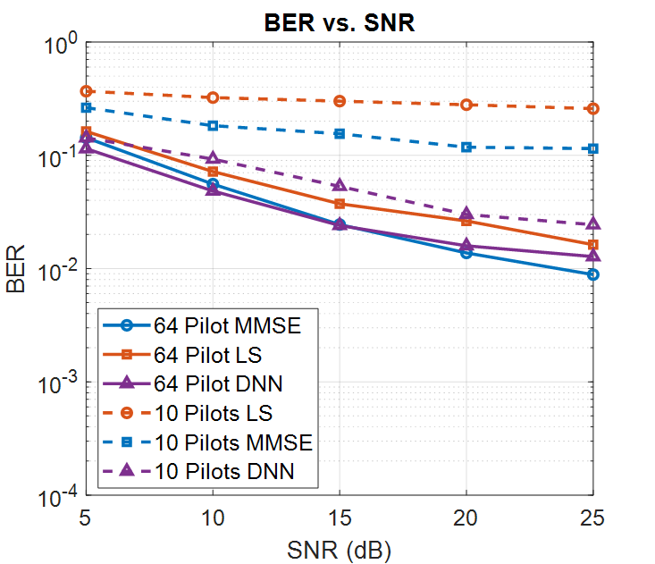
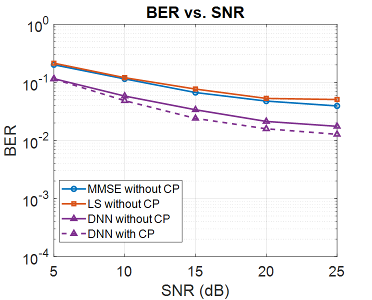
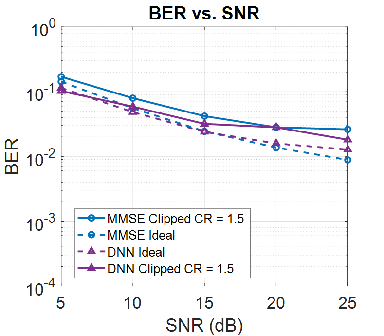
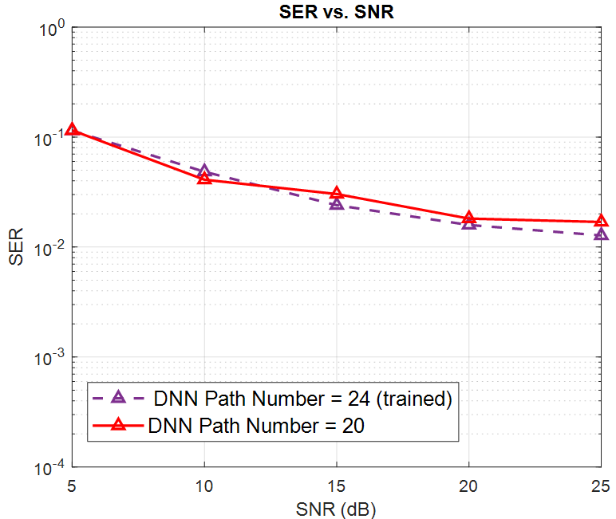

# OFDM Channel Estimation & Signal Detection Power of DNN
MATLAB implementation of 'Power of Deep Learning for Channel Estimation and Signal Detection in OFDM Systems'

All existing implementations I found were **incomplete** or **incorrect** with respect to the original paper. This repo fixes those issues and adds all missing features building on https://github.com/dianixn/Signal_detection_OFDMPowerofDNN.

## Issues in Existing Implementations

1. **WINNER II Channel Model**  
   -  Most ignore the paper’s use of MATLAB-only continuous-time WINNER II; Python implementations drop it entirely.

2. **OFDM Symbol-Rate vs. Sample-Rate Mismatch**  
   -  All ignore that OFDM samples are at **symbol rate**, whereas WINNER II is a **continuous-time (sample-rate)** model. Passing OFDM samples through the channel is incorrect.

3. **Path-Count & Delay-Spread Misconfiguration**  
   - Most ignore that the paper specifies 24 paths and 16-symbol max delay.

4. **Missing MMSE Baseline**  
   - Most ignore that the paper compares **LS**, **MMSE**, and **DNN**. MMSE is often omitted or improperly implemented without correct second-order stats.

5. **Paper’s Simulation Scenarios Left Out**  
   - All skipped pilot variation, CP removal, clipping noise, and robustness tests, though shown in the paper.

---

## Fixes

- **Computed and Saved Equivalent Discrete-Time Channel Impulse Responses**  
  Using **pulse shaping → upsampling → channel → matched filtering → downsampling**, to match continuous-time WINNER II in symbol-rate domain.

- **Configured 24-Path & 16-Sample Delay**  
  Requires understanding the channel model’s delay distribution and CDF.

- **True MMSE Estimator**  
  Statistics are extracted from saved responses.

- **Full Simulation Scenarios Implemented**  
  - Pilot-count variation  
  - Cyclic-prefix removal  
  - Clipping noise 
  - Mismatched training vs. testing (Robustness)
## Sample Results
### Pilot-count Effect

### CP Removal Effect

### Clipping Effect

### Mismatch Effect

## Presentation
